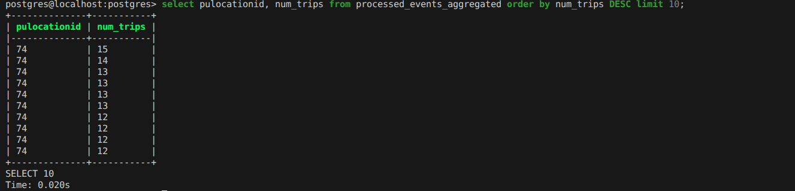
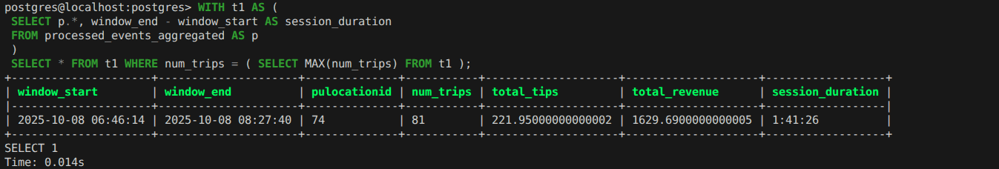
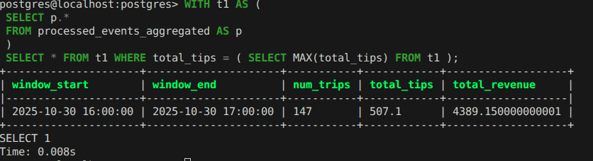

# Project 7 - Streaming Data Processing with Flink and Kafka (Redpanda)

In this assignment, I practiced streaming with Kafka (Redpanda) and PyFlink.

We use Redpanda, a drop-in replacement for Kafka. It implements the same protocol, so any Kafka client library works with it unchanged.

For this homework I used Green Taxi Trip data from October 2025:

    green_tripdata_2025-10.parquet


The final build is shown as the following diagram:

```
Producer (Python) -> Kafka (Redpanda) -> Flink -> PostgreSQL
```

In order to build this streaming process using Redpanda/Kafka the following steps were implemented:
1. A docker-compose file was created with redpanda, postgreSQL, and flink jobmanager and flink taskmanager services
2. Developed the following:
    - A `models` python file that includes the functions needed for our other python scripts
    - Stream `producer` (sender of data) python script that creates a topic called `green-trips` which will download our parquet data, format into a dictonary, and convert the dictonary into byte format and finally send it to our consumer processor. The following fields were kept: 'lpep_pickup_datetime', 'lpep_dropoff_datetime', 'PULocationID', 'DOLocationID', 'passenger_count', 'trip_distance', 'tip_amount', 'total_amount'.
    - Stream `consumer` (receiver of data) python script that will receive the data from our producer and decode and convert the data back into dictonary and insert data into a PostgreSQL database
    - Created a processed_events table in Postgres so the data can be received

Referenced python script files can be found here: [src folder](/modules/module_7/project_07/src/)

## Question 1. Redpanda version
Run rpk version inside the Redpanda container:

`docker exec -it workshop-redpanda-1 rpk version`

What version of Redpanda are you running?

> ANSWER: rpk version: v25.3.9


## Question 2. Sending data to Redpanda
Measure the time it takes to send the entire dataset and flush:
```python
from time import time

t0 = time()

# send all rows ...

producer.flush()

t1 = time()
print(f'took {(t1 - t0):.2f} seconds')
```

How long did it take to send the data?
> ANSWER: 300 seconds 

**Note**: Selecting closest answer due to the process taking 543.27 seconds. This process was ran locally with limited available computer resources.

Bash snippet:
```bash
Sent: Ride(lpep_pickup_datetime=1761954300000, lpep_dropoff_datetime=1761955680000, PULocationID=255, DOLocationID=25, passenger_count=nan, trip_distance=4.2, tip_amount=4.86, total_amount=37.29)
Sent: Ride(lpep_pickup_datetime=1761952980000, lpep_dropoff_datetime=1761953820000, PULocationID=195, DOLocationID=33, passenger_count=nan, trip_distance=3.0, tip_amount=0.0, total_amount=19.6)
took 543.27 seconds
```


## Question 3. Consumer - trip distance

Write a Kafka consumer that reads all messages from the green-trips topic (set auto_offset_reset='earliest').

Count how many trips have a trip_distance greater than 5.0 kilometers.

How many trips have trip_distance > 5?

>ANSWER: 8506

SQL snippet:
```sql
select count(*) from processed_events where trip_distance > 5
```

---
## Part 2: PyFlink (Questions 4-6)
The following steps were taken to setup PyFlink:
- Download Flink build files (Dockerfile, pyproject.flink.toml, flink-config.yaml)
- Add jobmanager and taskmanager services to docker-compose.yaml file in order to run jobs through flink
- Re-used the `producer` python script file that will send the streaming data to the SQL table sink
- Create an `aggregate_job` data python script file that will store the data to the SQL table sink using Flink
- Create a `processed_aggregate_events` table that will store the aggregate sql query data

## Question 4. Tumbling window - pickup location
Create a Flink job that reads from green-trips and uses a 5-minute tumbling window to count trips per PULocationID.

Write the results to a PostgreSQL table with columns: window_start, PULocationID, num_trips.

Which PULocationID had the most trips in a single 5-minute window?

>ANSWER: 74

SQL snippet:



## Question 5. Session window - longest streak
Create another Flink job that uses a session window with a 5-minute gap on PULocationID, using lpep_pickup_datetime as the event time with a 5-second watermark tolerance.

A session window groups events that arrive within 5 minutes of each other. When there's a gap of more than 5 minutes, the window closes.

Write the results to a PostgreSQL table and find the PULocationID with the longest session (most trips in a single session).

How many trips were in the longest session?

>ANSWER: 81

SQL snippet:



## Question 6. Tumbling window - largest tip

Create a Flink job that uses a 1-hour tumbling window to compute the total tip_amount per hour (across all locations).

Which hour had the highest total tip amount?

>ANSWER: 2025-10-30 16:00:00

SQL snippet:



